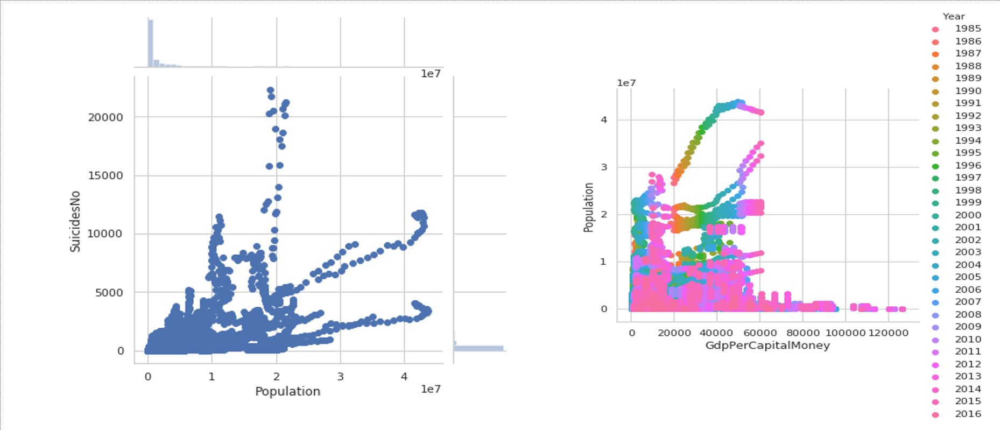

# Suicide-prediction-in-different-parts-of-the-world
Suicide is the act of taking one’s own life intentionally. It is considered as a major mental health problem in the world. 
The data we used in this project are taken from United Nations Development Program (2018), World Bank (2018), Suicide in the Twenty-First Century (2017) and World health Organization (2018) Suicide prevention. 

The purpose of this project is to redesign the bad visualizations and to make predictions based on given data.
* Bad Visualizations:

* Good Visualizations

This visualization is interactive and quite flexible, which can show the suicide trend with respect to population, GDP per year and capita for different countries of the world.
